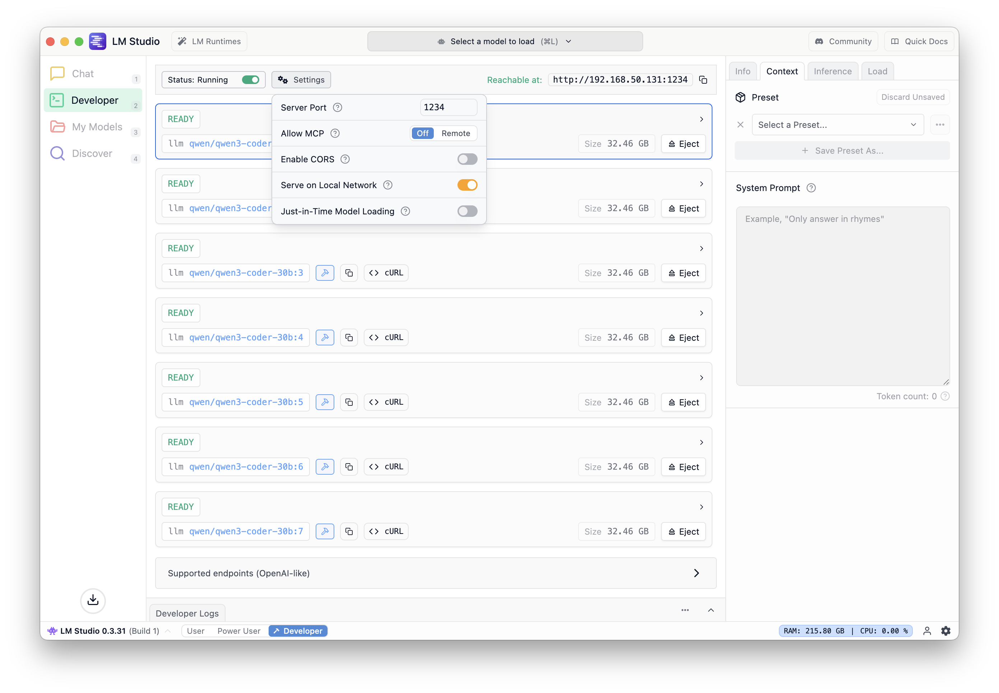

this is a fork of lm-studio load balancer. 

in this changed version, requests are now distributed across all loaded models, specifically for use with embedding, so the requests will be distributed across all of the same models loaded multiple times as name:#. tested by loading 5 of the same embedding model. 

(i am not much of a coder, this is probably messy, but it works)

# LM Studio Load Balancer

[](https://badge.fury.io/js/lm-studio-loadbalancer)
[](https://opensource.org/licenses/MIT)
[](https://nodejs.org/)
[](https://github.com/autolocalize/lm-studio-loadbalancer/actions)
[](https://codecov.io/gh/autolocalize/lm-studio-loadbalancer)

An intelligent load balancer for LM Studio that distributes requests across multiple loaded language models, optimizing resource utilization and response times.

If you make multiple requests to a single model loaded in LM Studio, it will queue the requests. However, if your computer has sufficient VRAM, you can load multiple instances of the same model. You can also send simultaneous requests to loaded models with different names. This Load Balancer app manages requests by changing the model name in the request, ensuring it is routed to an idle model instance. This allows you to serve multiple requests at the same time.



## 🚀 Features

- **Intelligent Load Balancing**: Automatically distributes requests across available models based on current load
- **Model Discovery**: Automatically detects and manages loaded LM Studio models
- **Health Monitoring**: Real-time health checks and model status tracking
- **Streaming Support**: Full support for streaming responses from LM Studio
- **Request Tracking**: Tracks in-progress requests to prevent overloading individual models
- **Automatic Cleanup**: Cleans up unavailable models and completed requests
- **RESTful API**: Clean REST endpoints for monitoring and management

## 📋 Prerequisites

- [Node.js](https://nodejs.org/) (version 14 or higher)
- [LM Studio](https://lmstudio.ai/) running on `localhost:1234`
- At least one model loaded in LM Studio


## 🛠️ Installation

1. Clone this repository:
```bash
git clone https://github.com/autolocalize/lm-studio-loadbalancer.git
cd lm-studio-loadbalancer
```

2. Install dependencies:
```bash
npm install
```

3. Start LM Studio and load at least one model

4. Start the load balancer:
```bash
npm start
```

The load balancer will start on port `4321` and proxy requests to LM Studio on port `1234`.

## 📖 Usage

### Basic Configuration

The load balancer will automatically:
- Detect loaded models from LM Studio
- Distribute requests using a least-loaded algorithm
- Handle streaming responses
- Monitor model health every 30 seconds

### API Endpoints

#### Health Check
```bash
GET /health
```

Returns the current status of the load balancer:
```json
{
  "status": "healthy",
  "availableModels": ["model1", "model2"],
  "inProgressModels": ["model1"],
  "totalRequests": 42
}
```

#### Model Status
```bash
GET /models
```

Returns detailed information about available models:
```json
{
  "availableModels": ["model1", "model2"],
  "inProgressModels": ["model1"],
  "freeModels": ["model2"]
}
```

#### Chat Completions
```bash
POST /v1/chat/completions
```

Compatible with OpenAI's chat completions API. The load balancer will automatically replace the model parameter with an available model:

```json
{
  "model": "any-model-name",
  "messages": [
    {
      "role": "user",
      "content": "Hello! How are you?"
    }
  ],
  "max_tokens": 100,
  "stream": false
}
```

### Testing

Run the test suite to verify everything is working:

```bash
npm test
```

This will:
- Check the load balancer health
- Verify model discovery
- Test LM Studio connectivity
- Validate chat completion functionality

## ⚙️ Configuration

You can modify the following constants in `server.js`:

- `LM_STUDIO_URL`: LM Studio server URL (default: `http://localhost:1234`)
- `LOAD_BALANCER_PORT`: Load balancer port (default: `4321`)
- `modelRefreshInterval`: Model discovery interval in milliseconds (default: `30000`)

## 🔧 Development

### Running in Development Mode

```bash
npm run dev
```

This will start the server with `--watch` flag for automatic restarts on file changes.

### Project Structure

```
lm-studio-loadbalancer/
├── server.js          # Main load balancer server
├── test.js            # Test suite
├── package.json       # Project dependencies and scripts
├── .gitignore         # Git ignore file
└── README.md          # This file
```

## 🤝 Contributing

Contributions are welcome! Please feel free to submit a Pull Request. For major changes, please open an issue first to discuss what you would like to change.

### Development Guidelines

- Follow the existing code style
- Add tests for new features
- Update documentation as needed
- Ensure all tests pass before submitting

## 📝 License

This project is licensed under the MIT License - see the [LICENSE](LICENSE) file for details.

## 🙋‍♂️ Support

If you encounter any issues or have questions:

1. Check the [Issues](https://github.com/autolocalize/lm-studio-loadbalancer/issues) page
2. Create a new issue with detailed information
3. Make sure LM Studio is running and accessible

## 🔗 Related Projects

- [LM Studio](https://lmstudio.ai/) - Run local LLMs
- [OpenAI API](https://platform.openai.com/docs/api-reference) - API compatibility

---

**Note**: This project is not affiliated with LM Studio. It's an independent open-source tool designed to enhance LM Studio functionality.
